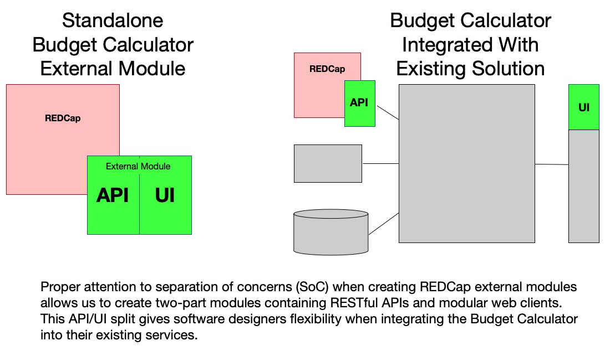

# Budget Calculator Services and Client

The Budget Calculator uses a ReactJS relationship based separation of concerns (SoC) coupled with the ECMAScript Fetch API and PHP based RESTful APIs for further separation of concerns at the HTTP pipeline level.

That means, devolpers can use the Budget Calculator's web client components with or without the Budget Calculator's PHP services. Developers can reorganize the Budget Calculator's React client in similar fashion to moving around bricks in a LEGO&reg; model. Also, institutions may choose to use the Budget Calculator's PHP services as the basis for new applications, or integrate the Budget calculator's PHP services and/or React client into an existing enterprise tool with minimal fuss.

# Budget Calculator Link

Once the Budget Calculator REDCap external module is installed and configured, the home page is located at:

&lt;REDCap URL path&gt;/modules/budget_calculator_v1.0/resources/bcclient/index.html

For example, if the REDCap is installed for on the domain 'https://example.com/redcap', then the location of the installed Budget Calculator is

https://example.com/redcap/modules/budget_calculator_v1.0/resources/bcclient/index.html

# ReactJS

The Budget Calculator React client was bootstrapped with [Create React App](https://github.com/facebook/create-react-app).

## Available Scripts

In the project directory, you can run:

### `npm start`

Runs the app in the development mode. 
Open [http://localhost:3000](http://localhost:3000) to view it in the browser.

The page will reload if you make edits. 
You will also see any lint errors in the console.

During development of the Budget Calculator client, you may find it helpful to connect to a Budget Calculator's RESTful APIs by installing the Budget Calculator external module on a REDCap server and configuring your development ReactJS client's 'src/js/config.js' to point at the server's URL and REDCap path so that the Budget Calculator's client can retreive and display meaningful data from the external module's service endpoints.

### `npm redcap-build`

Transpiles, optimizes, minifies the current Budget Calculator's ReactJS code. Then, copies the production build to the parent PHP project's static files directory for inclusion with the PHP composure build used to generate the Budget Calculator REDCap external module.

When building the Budget Calculator external module for use on a REDCap server, this ReactJS project must be built first using the 'redcap-build' script before building the final Composure PHP project.

### `npm run build`

Builds the app for production to the `build` folder. 
It correctly bundles React in production mode and optimizes the build for the best performance.

The build is minified and the filenames include the hashes. 
Your app is ready to be deployed!

See the section about [deployment](https://facebook.github.io/create-react-app/docs/deployment) for more information.

This script is useful for building production versions of the Budget Calculator for use in projects where the PHP services are not needed, or in projects where additional tiers exist between the PHP services and the React client.

### `npm run test`

_**Under development**_ ... Runs automated unit tests to check the client code is working as expected.
